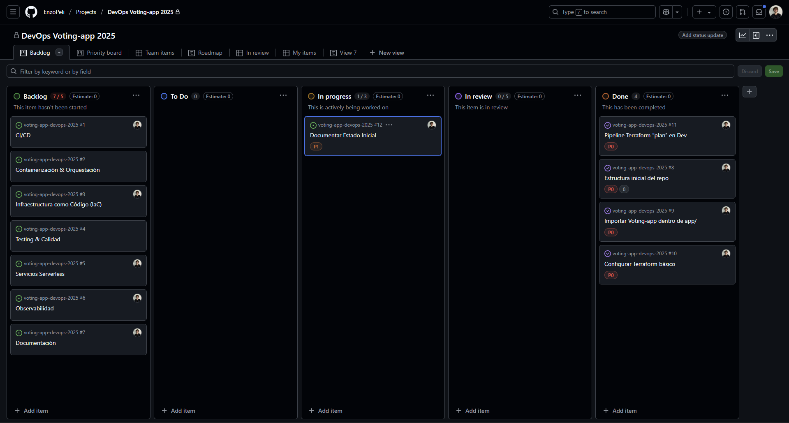
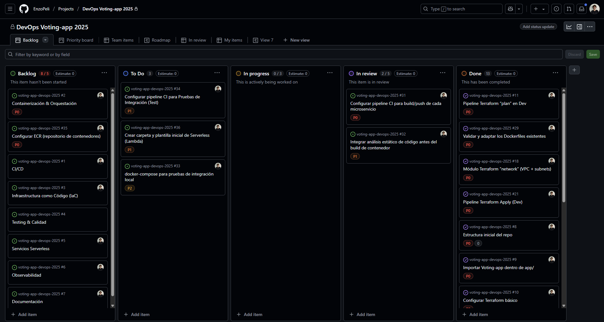
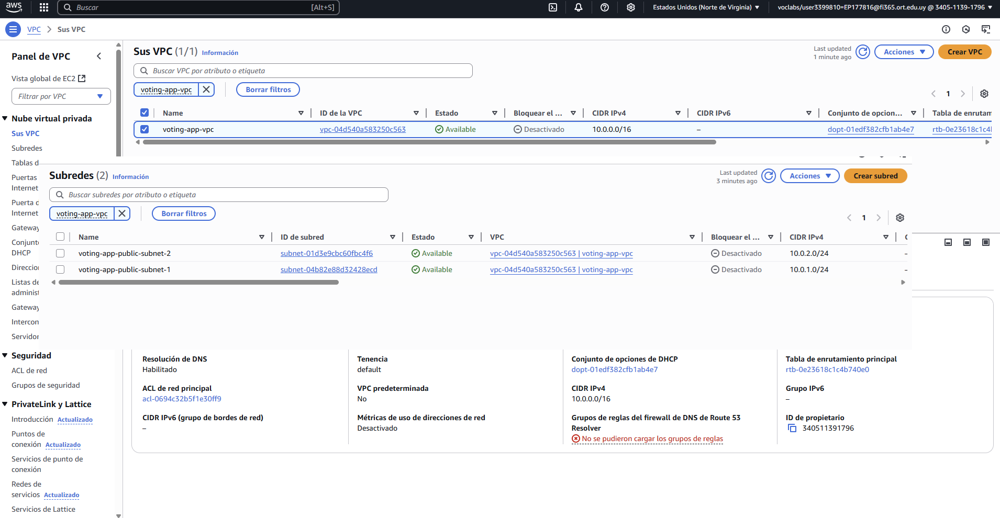

# DevOps Voting-app 2025

## Contenidos

1. [Visión General](#visión-general)  
2. [Estructura del Repositorio](#estructura-del-repositorio)
3. [Estrategia de Branching](#estrategia-de-branching)
4. [Kanban & Flujo de Trabajo](#kanban--flujo-de-trabajo)  
5. [Infraestructura como Código (IaC)](#infraestructura-como-código-iac)  
6. [CI/CD](#cicd)  
7. [Containerización & Docker Compose](#containerización--docker-compose)  
8. [Serverless](#serverless)  
9. [Observabilidad](#observabilidad)  
10. [Próximos Pasos](#próximos-pasos)


## Visión General

> Este proyecto busca aplicar DevOps, para asegurar despliegues fiables en tres ambientes (Dev, Test y Prod). 
> Abarca:
> - Infraestructura como Código con Terraform  
> - Pipelines de CI/CD en GitHub Actions  
> - Containerización de microservicios y orquestación  
> - Pruebas de calidad y análisis estático  
> - Servicios Serverless para automatizaciones  
> - Observabilidad y alertas  
> - Documentación y presentación de la solución 
> - Control de versiones y estrategia de branching

## Estructura del Repositorio


```text
voting-app-devops-2025/
├── app/            # Código fuente de la Voting-app
├── infra/          # Módulos y root de Terraform
├── .github/        # Workflows de GitHub Actions
├── serverless/     # Funciones Lambda
├── docs/           # Imágenes, diagramas y guías adicionales
└── README.md       # Documentación principal del proyecto
```

## Estrategia de Branching

Para gestionar los tres entornos (Dev, Test y Prod) usamos un flujo de ramas:

- **Ramas principales**  
  - `develop`: integraciones y despliegue automático a Dev.  
  - `test`: despliegue a Test tras aprobar quality gates.  
  - `main`: despliegue a Prod, con tagging semántico (`vX.Y.Z`).

- **Feature branches**  
  - Se crean desde `develop`:  
    ```bash
    git checkout develop
    git checkout -b feature/<epic>-<descripción>
    ```
  - Nombre: `feature/<epic>-<descripción-corta>` (p.ej. `feature/docker-build`).  
  - Al terminar, push y PR a `develop`; debe pasar el CI de Dev y la revisión de un reviewer.

- **Promoción de cambios**  
  1. **Dev → Test**: abrir PR `develop → test`, aprobar gates en Test (pruebas de integración, carga, etc.), mergear.  
  2. **Test → Prod**: abrir PR `test → main`, aprobar gates de seguridad y despliegue, mergear y taguear.

## Kanban & Flujo de Trabajo

El proyecto utiliza un tablero Kanban en GitHub Projects con las siguientes columnas:

- **Backlog**: Tareas identificadas y pendientes de priorizar.  
- **To Do**: Tareas priorizadas y listas para arrancar.  
- **In Progress**: Tareas en desarrollo.  
- **Review**: Tareas completadas que esperan revisión o validación.  
- **Done**: Tareas finalizadas y documentadas.

### Estado Inicial



### Estado 2



Cada tarjeta del tablero corresponde a un Issue en GitHub, etiquetado con su Épica y prioridad (P0–P2). El flujo de trabajo es:

1. Se crea el Issue en **Backlog**.  
2. Se pasa a **To Do** cuando se prioriza para el próximo sprint.  
3. Al iniciar trabajo, se mueve a **In Progress**.  
4. Al completar, se mueve a **Review** y se abre el Pull Request asociado.  
5. Tras la aprobación y merge, se marca como **Done** y se documenta (capturas, actualizaciones en `docs/` o en el README).


## Infraestructura como Código (IaC)

La infraestructura se define con Terraform en la carpeta `infra/`, estructurada de la siguiente forma:

```text
infra/
├── modules/
│   ├── ecr-repo/         # Módulo para crear el repositorio ECR
│   │   ├── main.tf
│   │   ├── variables.tf
│   │   └── outputs.tf
│   ├── network/          # Módulo de red (VPC, subnets, routing)
│   │   ├── main.tf
│   │   ├── variables.tf
│   │   └── outputs.tf
│   └── security_group/   # Módulo de Security Group (HTTP/SSH)
│       ├── main.tf
│       ├── variables.tf
│       └── outputs.tf
│
├── main.tf               # Root module: orquesta los módulos
├── variables.tf          # Variables globales (env, región, CIDRs, etc.)
├── outputs.tf            # Outputs del proyecto (vpc_id, sg_id, ecr_url, …)
├── dev.tfvars            # Valores de variables para entorno Dev
└── tfplan                # (opc.) Plan generado para revisión
```

### Módulos

#### ecr-repo (infra/modules/ecr-repo)
- Define repositorios AWS ECR para los servicios
- Variables:
  - `name`: Nombre del repositorio ECR
  - `tags`: Etiquetas a aplicar al repositorio (opcional)
- Outputs: `repository_url`

#### network (infra/modules/network)
- Crea la VPC y dos subnets públicas
- Variables:
  - `vpc_cidr`: CIDR block para la VPC (default: "10.0.0.0/16")
  - `public_subnets_cidrs`: Lista de CIDR blocks para subnets (default: ["10.0.1.0/24", "10.0.2.0/24"])
  - `region`: Región de AWS (default: "us-east-1")
  - `availability_zones`: Lista de AZs para las subnets
- Outputs: `vpc_id`, `public_subnet_ids`

#### security_group (infra/modules/security_group)
- Crea un Security Group para los servicios
- Variables:
  - `vpc_id`: ID de la VPC donde se creará el SG
  - `sg_name`: Nombre del Security Group (default: "sg-voting-app")
  - `ingress_rules`: Lista de reglas de ingreso configurables (puertos, protocolos, CIDRs)
- Outputs: `sg_id`

### Root Module

En `infra/main.tf` se invocan los módulos y se pasan las variables:

```hcl
# Repositorio ECR para el servicio vote
module "ecr_vote" {
  source = "./modules/ecr-repo"
  name   = "voting-app-vote"
  tags   = var.tags
}

# Repositorio ECR para el servicio result
module "ecr_result" {
  source = "./modules/ecr-repo"
  name   = "voting-app-result"
  tags   = var.tags
}

module "network" {
  source               = "./modules/network"
  vpc_cidr             = var.vpc_cidr
  public_subnets_cidrs = var.public_subnets_cidrs
}

module "security_group" {
  source = "./modules/security_group"
  vpc_id = module.network.vpc_id
}
```

Los outputs de todos los módulos se exponen en `infra/outputs.tf`.

### Backend Remoto

El estado remoto de Terraform se configura directamente en `infra/main.tf` con un backend S3:

```hcl
terraform {
  backend "s3" {
    bucket         = "voting-app-terraform-state-177816"
    key            = "voting-app/terraform.tfstate"
    region         = "us-east-1"
    dynamodb_table = "terraform-locks"
  }
}
```

- **bucket**: `voting-app-terraform-state-177816`
- **key**: `voting-app/terraform.tfstate`
- **region**: `us-east-1`
- **dynamodb_table**: `terraform-locks` (para locking de estado)

### Estado Actual en AWS



> **Nota**: La captura anterior muestra la VPC y sus subnets en AWS Console, confirmando que Terraform aplicó correctamente los recursos en el entorno Dev.

### Variables por Ambiente

- `infra/dev.tfvars`
- `infra/test.tfvars` (pendiente)
- `infra/prod.tfvars` (pendiente)

### Comandos Útiles

```bash
cd infra
terraform init
terraform plan -var-file=dev.tfvars
terraform apply -auto-approve -var-file=dev.tfvars
```


## CI/CD

La integración y entrega continua se implementa con GitHub Actions. Los workflows actuales son:

### 1. Infraestructura (Terraform)

- **Archivo**: `.github/workflows/terraform-dev.yml`
- **Nombre**: "Terraform Plan & Apply (Dev)"
- **Disparador**: push a la rama `develop`
- **Jobs**:
  1. `terraform`
     - Configura credenciales AWS
     - Setup Terraform
     - `terraform init`
     - `terraform plan -var-file=dev.tfvars`
     - `terraform apply -auto-approve -var-file=dev.tfvars`

### 2. Análisis Estático y Build de Contenedores

- **Archivo**: `.github/workflows/docker-dev.yml`
- **Nombre**: "CI – Static Analysis & Docker Build (Dev)"
- **Disparador**: push a la rama `develop`
- **Jobs**:
  1. `static-analysis` (matriz por servicio)
     - Python (vote, seed-data): flake8
     - Node.js (result): eslint
     - C# (worker): dotnet format
     - Genera reportes y sube artefactos
  2. `docker`
     - Depende de `static-analysis`
     - Login en ECR
     - Build y push de imágenes

### (Pendiente) Workflows Futuros

1. **Test**
   - Pruebas de integración
   - Validación de endpoints
   - Pruebas de carga

2. **Producción**
   - Deploy a ECS/EKS
   - Control de versiones
   - Gates de calidad

---

> **Variables / Secrets** necesarios:  
> - `AWS_ACCESS_KEY_ID`  
> - `AWS_SECRET_ACCESS_KEY`  
> - `AWS_SESSION_TOKEN`  
> - `AWS_DEFAULT_REGION`

## Containerización & Docker Compose

Los microservicios de la Voting-app se empaquetan en contenedores Docker y se orquestan localmente con Docker Compose.

### Validación de Dockerfiles

- **app/vote**
  - Base: `python:3.11-slim`
  - Expone puerto `80` (mapeado a `8080` en host)
  - Health-check: `curl -f http://localhost`
  - Modo desarrollo: detecta cambios en archivos Python y reinicia automáticamente el servidor

- **app/result**
  - Base: Node.js
  - Expone puerto `80` (mapeado a `8081` en host)
  - Modo desarrollo: reinicia automáticamente el servidor y permite depuración remota

- **app/seed-data**
  - Job que carga datos iniciales en la base de datos
  - En perfil `seed` separado (no se ejecuta por defecto, usar `--profile seed` para activarlo)

- **app/worker**
  - Base: .NET
  - Depende de `redis` y `db`
  - No expone puertos HTTP

### Levantar el stack local

Se proporciona un `docker-compose.yml` en `app/` con las siguientes características:

- Redes: `front-tier` y `back-tier`
- Healthchecks configurados
- Volúmenes para desarrollo
- Perfiles para seed-data

```bash
# Configurar variables de entorno
cd app/
cp .env.example .env    # Copiar plantilla de variables de entorno

# Levantar servicios principales
docker compose up --build -d

# Ver logs de servicios
docker compose logs -f vote result worker

# Ejecutar seed-data (opcional)
docker compose --profile seed up --build -d seed

# Detener y limpiar
docker compose down --volumes
```

> **Nota**: El archivo `.env` contiene las variables de entorno necesarias para los servicios:
> - Credenciales de PostgreSQL
> - Configuración de Redis
> - Puertos de servicios

## Pruebas locales con Docker Compose

Seguir los pasos anteriores en la sección "Levantar el stack local" para probar la aplicación. Los servicios estarán disponibles en:

- Interfaz de votación: http://localhost:8080
- Interfaz de resultados: http://localhost:8081
