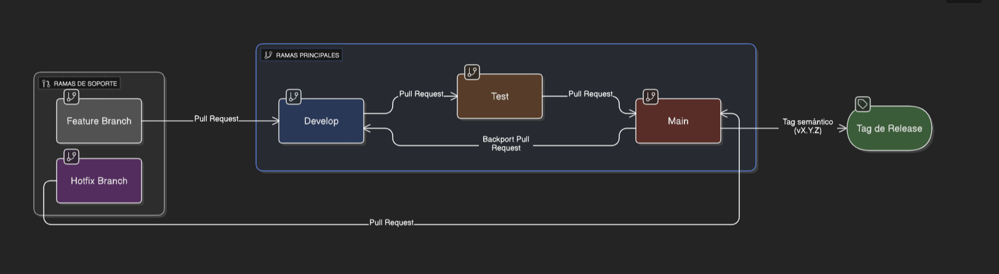

# DevOps Voting-app 2025

## Contenidos

1. [Visión General](#visión-general)  
2. [Estructura del Repositorio](#estructura-del-repositorio)
3. [Estrategia de Branching](#estrategia-de-branching)
4. [Kanban & Flujo de Trabajo](#kanban--flujo-de-trabajo)  
5. [Infraestructura como Código (IaC)](#infraestructura-como-código-iac)  
6. [CI/CD](#cicd)  
7. [Containerización & Docker Compose](#containerización--docker-compose)  
8. [Serverless](#serverless)  
9. [Observabilidad](#observabilidad)  
10. [Lecciones Aprendidas](#lecciones-aprendidas)


## Visión General

> Este proyecto aplica técnicas de DevOps, para despliegues en tres ambientes (Dev, Test y Prod). 
> - Se utilizan:
> - Infraestructura como Código con Terraform  
> - Pipelines de CI/CD en GitHub Actions  
> - Containerización de microservicios y orquestación  
> - Pruebas de calidad y análisis estático  
> - Servicios Serverless para automatizaciones  
> - Observabilidad y alertas  
> - Documentación y presentación de la solución 
> - Control de versiones y estrategia de branching

## Estructura del Repositorio


```text
voting-app-devops-2025/
├── app/            # Código fuente de la Voting-app
├── infra/          # Módulos y root de Terraform
├── k8s/            # Manifiestos de Kubernetes para despliegue en EKS
├── .github/        # Workflows de GitHub Actions
├── docs/           # Imágenes, diagramas y guías adicionales
└── README.md       # Documentación principal del proyecto
```

## Estrategia de Branching

### Diagrama de Ramas



Para gestionar los tres entornos (Dev, Test y Prod) usamos un flujo de ramas:

- **Ramas principales**  
  - `develop`: Análisis estático, despliegue automático a Dev.  
  - `test`: Pruebas de integración, despliegue automático a Test.  
  - `main`: despliegue a Prod, puede usarse con tagging semántico (`vX.Y.Z`).

- **Feature branches**  
  - Se crean desde `develop`:  
    ```bash
    git checkout develop
    git checkout -b feature/<epic>-<descripción>
    ```
  - Nombre: `feature/<epic>-<descripción-corta>` (p.ej. `feature/docker-build`).  
  - Al terminar, push y PR a `develop`; debe pasar el CI de Dev y la revisión de un reviewer.

- **Promoción de cambios**  
  1. **Dev → Test**: abrir PR `develop → test`, aprobar gates en Test (pruebas de integración), mergear.  
  2. **Test → Prod**: abrir PR `test → main`, aprobar gates de seguridad y despliegue, mergear y taguear.

## Kanban & Flujo de Trabajo

El proyecto utiliza un tablero Kanban en GitHub Projects con las siguientes columnas:

- **Backlog**: Tareas identificadas y pendientes de priorizar.  
- **To Do**: Tareas priorizadas y listas para arrancar.  
- **In Progress**: Tareas en desarrollo.  
- **Review**: Tareas completadas que esperan revisión o validación.  
- **Done**: Tareas finalizadas y documentadas.

### Estado Inicial


### Estado 2


### Estado 3


Cada tarjeta del tablero corresponde a un Issue en GitHub, etiquetado con su Épica y prioridad (P0–P2). El flujo de trabajo es:

1. Se crea el Issue en **Backlog**.  
2. Se pasa a **To Do** cuando se prioriza para el próximo sprint.  
3. Al iniciar trabajo, se mueve a **In Progress**.  
4. Al completar, se mueve a **Review** y se abre el Pull Request asociado.  
5. Tras la aprobación y merge, se marca como **Done** y se documenta (capturas, actualizaciones en `docs/` o en el README).


## Infraestructura como Código (IaC)

La infraestructura se define con Terraform en la carpeta `infra/`, estructurada de la siguiente forma:

```text
infra/
├── modules/
│   ├── ecr-repo/         # Módulo para crear el repositorio ECR
│   │   ├── main.tf
│   │   ├── variables.tf
│   │   └── outputs.tf
│   ├── network/          # Módulo de red (VPC, subnets, routing)
│   │   ├── main.tf
│   │   ├── variables.tf
│   │   └── outputs.tf
│   ├── security_group/   # Módulo de Security Group (HTTP/SSH)
│   │   ├── main.tf
│   │   ├── variables.tf
│   │   └── outputs.tf
│   ├── eks_cluster/      # Módulo para crear el cluster EKS
│   │   ├── main.tf
│   │   ├── variables.tf
│   │   └── outputs.tf
│   ├── lambda-alerts/    # Módulo para crear la función Lambda
│   │   ├── main.tf 
│   │   ├── variables.tf
│   │   └── outputs.tf
│
├── main.tf               # Root module: orquesta los módulos
├── variables.tf          # Variables globales (env, región, CIDRs, etc.)
├── outputs.tf            # Outputs del proyecto (vpc_id, sg_id, ecr_url, …)
├── dev.tfvars            # Valores de variables para entorno Dev
├── test.tfvars           # Valores de variables para entorno Test
├── prod.tfvars           # Valores de variables para entorno Prod
├── tfplan                # (opc.) Plan generado para revisión
├── eks_monitoring.tf     # Módulo para crear alarma de CloudWatch


```

### Módulos

#### ecr-repo (infra/modules/ecr-repo)
- Definicion de  repositorios AWS ECR para los servicios
- Variables:
  - `name`: Nombre del repositorio ECR
  - `tags`: Etiquetas a aplicar al repositorio (opcional)
- Outputs: `repository_url`

#### network (infra/modules/network)
- Crea la VPC y dos subnets públicas
- Variables:
  - `vpc_cidr`: CIDR block para la VPC (default: "10.0.0.0/16")
  - `public_subnets_cidrs`: Lista de CIDR blocks para subnets (default: ["10.0.1.0/24", "10.0.2.0/24"])
  - `region`: Región de AWS (default: "us-east-1")
  - `availability_zones`: Lista de AZs para las subnets
- Outputs: `vpc_id`, `public_subnet_ids`

#### security_group (infra/modules/security_group)
- Crea un Security Group para los servicios
- Variables:
  - `vpc_id`: ID de la VPC donde se creará el SG
  - `sg_name`: Nombre del Security Group (default: "sg-voting-app")
  - `ingress_rules`: Lista de reglas de ingreso configurables (puertos, protocolos, CIDRs)
- Outputs: `sg_id`

#### eks_cluster (infra/modules/eks_cluster)
- Crea un cluster EKS y un grupo de nodos para ejecutar la aplicación
- Variables:
  - `cluster_name`: Nombre del cluster EKS
  - `node_group_name`: Nombre del grupo de nodos
  - `subnet_ids`: IDs de las subnets donde se desplegará el cluster
  - `cluster_role_arn`: ARN del rol IAM para el cluster
  - `node_role_arn`: ARN del rol IAM para los nodos
  - `ec2_ssh_key_name`: Nombre de la clave SSH para acceder a los nodos
  - `instance_types`: Lista de tipos de instancia para los nodos
  - `desired_capacity`: Capacidad deseada del grupo de nodos
  - `min_capacity`: Capacidad mínima del grupo de nodos
  - `max_capacity`: Capacidad máxima del grupo de nodos
  - `tags`: Etiquetas a aplicar a los recursos
- Outputs: `cluster_name`, `cluster_endpoint`, `cluster_certificate_authority`, `node_group_name`

#### lambda-alerts (infra/modules/lambda-alerts)
- Crea una función Lambda para procesar y enviar alertas a través de SNS
- Variables:
  - `prefix`: Prefijo para nombrar los recursos (default: "alerts")
  - `sns_topic_arn`: ARN del tema SNS donde se publicarán las alertas
  - `lambda_src`: Ruta al archivo Python de la función Lambda
  - `timeout`: Tiempo máximo de ejecución en segundos (default: 30)
  - `memory_size`: Memoria asignada a la función en MB (default: 128)
  - `log_retention_days`: Días de retención de logs (default: 7)
  - `tags`: Etiquetas a aplicar a los recursos
- Outputs: `function_name`, `function_arn`, `errors_alarm_name`, `duration_alarm_name`

### Root Module

En `infra/main.tf` se invocan los módulos y se pasan las variables. Los recursos están parametrizados por workspace para separar ambientes (dev, test, prod):

```hcl
# Repositorios ECR parametrizados por workspace
module "ecr_vote" {
  source = "./modules/ecr-repo"
  name   = "voting-app-vote-${terraform.workspace}"
  tags   = merge(var.tags, { Environment = terraform.workspace })
}

module "ecr_result" {
  source = "./modules/ecr-repo"
  name   = "voting-app-result-${terraform.workspace}"
  tags   = merge(var.tags, { Environment = terraform.workspace })
}

module "ecr_seed" {
  source = "./modules/ecr-repo"
  name   = "voting-app-seed-data-${terraform.workspace}"
  tags   = merge(var.tags, { Environment = terraform.workspace })
}

module "ecr_worker" {
  source = "./modules/ecr-repo"
  name   = "voting-app-worker-${terraform.workspace}"
  tags   = merge(var.tags, { Environment = terraform.workspace })
}

# Módulo Lambda Alerts para monitoreo y alertas
module "lambda_alerts" {
  source = "./modules/lambda-alerts"
  
  prefix       = "voting-app"
  sns_topic_arn = aws_sns_topic.alerts.arn
  lambda_src   = "${path.module}/modules/lambda-alerts/src/alert.py"
  
  # Configuración opcional
  timeout     = 30
  memory_size = 128
  log_retention_days = 7
  
  tags = merge(var.tags, {
    Environment = terraform.workspace
    Component   = "monitoring"
  })
}

# Repositorio ECR para el servicio worker
module "ecr_worker" {
  source = "./modules/ecr-repo"
  name   = "voting-app-worker"
  tags   = var.tags
}

# Modulo de Network
module "network" {
  source               = "./modules/network"
  vpc_cidr             = var.vpc_cidr
  public_subnets_cidrs = var.public_subnets_cidrs
}

# Modulo de Security Group
module "security_group" {
  source = "./modules/security_group"
  vpc_id = module.network.vpc_id
}

# Modulo de EKS Cluster
module "eks_cluster" {
  source = "./modules/eks_cluster"

  cluster_name = "voting-app-eks"
  node_group_name = "voting-app-node-group"
  cluster_role_arn = data.aws_iam_role.lab_role.arn
  node_role_arn = data.aws_iam_role.lab_role.arn
  subnet_ids = module.network.public_subnet_ids
  ec2_ssh_key_name = "voting-app-ssh-key"
  instance_types = ["t3.small"]
  desired_capacity = 2
  min_capacity = 1
  max_capacity = 3
  tags = var.tags
}


```

Los outputs de todos los módulos se encuentran en `infra/outputs.tf`.

### Backend Remoto

El estado remoto de Terraform se configura directamente en `infra/main.tf` con un backend S3:

Con el uso de workspaces, Terraform automáticamente separa los estados por ambiente (`env:/workspace`) dentro del mismo bucket.

```hcl
terraform {
  backend "s3" {
    bucket         = "voting-app-terraform-state-177816"
    key            = "voting-app/terraform.tfstate"
    region         = "us-east-1"
    dynamodb_table = "terraform-locks"
  }
}
```

### Creacion de Bucket para Terraform State (CLI)

Para crear el bucket y la tabla de DynamoDB para el estado de Terraform, se puede ejecutar el siguiente script:
```bash
export AWS_PROFILE=default
export AWS_REGION=us-east-1
export TF_STATE_BUCKET=voting-app-terraform-state-177816
export DYNAMO_LOCK_TABLE=terraform-locks

# Crear el bucket para el estado de Terraform
aws s3 mb s3://$TF_STATE_BUCKET --region $AWS_REGION

# Crear la tabla de DynamoDB para el locking
aws dynamodb create-table \
  --table-name $DYNAMO_LOCK_TABLE \
  --attribute-definitions AttributeName=LockID,AttributeType=S \
  --key-schema AttributeName=LockID,KeyType=HASH \
  --billing-mode PAY_PER_REQUEST \
  --region $AWS_REGION

```

- **bucket**: `voting-app-terraform-state-177816`
- **key**: `voting-app/terraform.tfstate`
- **region**: `us-east-1`
- **dynamodb_table**: `terraform-locks` (para locking de estado)


### Variables por Ambiente

El proyecto utiliza archivos de variables específicos para cada ambiente, lo que permite personalizar la configuración según cada entorno:

- `infra/dev.tfvars`
- `infra/test.tfvars`
- `infra/prod.tfvars`

Estos archivos se utilizan en combinación con los workspaces de Terraform para mantener configuraciones independientes. Los pipelines de CI/CD seleccionan automáticamente el archivo de variables correspondiente al ambiente que se está desplegando.

### Comandos Útiles

```bash
cd infra
terraform init
terraform plan -var-file=dev.tfvars
terraform apply -auto-approve -var-file=dev.tfvars
```

### Terraform Workspaces

El proyecto utiliza Terraform Workspaces para separar los estados y recursos por ambiente (dev, test, prod). Esto permite mantener configuraciones independientes para cada entorno mientras se comparte el mismo código base.

#### Configuración Inicial

Antes de ejecutar los pipelines de CI/CD o trabajar con Terraform manualmente, es necesario realizar estos pasos iniciales:

1. **Crear el bucket S3 y la tabla DynamoDB** para el backend:
   ```bash
   # Crear bucket S3 (si no existe)
   aws s3api create-bucket --bucket voting-app-terraform-state-177816 --region us-east-1
   
   # Habilitar versionamiento en el bucket
   aws s3api put-bucket-versioning --bucket voting-app-terraform-state-177816 --versioning-configuration Status=Enabled
   
   # Crear tabla DynamoDB para locks
   aws dynamodb create-table --table-name terraform-locks \
     --attribute-definitions AttributeName=LockID,AttributeType=S \
     --key-schema AttributeName=LockID,KeyType=HASH \
     --billing-mode PAY_PER_REQUEST \
     --region us-east-1
   ```

2. **Inicializar Terraform** por primera vez:
   ```bash
   cd infra
   terraform init
   ```

3. **Crear los workspaces** para cada ambiente:
   ```bash
   terraform workspace new dev
   terraform workspace new test
   terraform workspace new prod
   ```

> **Nota**: Los pipelines de CI/CD están configurados para crear los workspaces automáticamente si no existen, pero es recomendable crearlos manualmente la primera vez para verificar que todo funcione correctamente.

## CI/CD

El proyecto utiliza GitHub Actions para automatizar el proceso de CI/CD, con flujos para cada ambiente.


### Diagrama de Flujos


#### Flujo de Despliegue Automatizado

El proceso de CI/CD está configurado para desplegar automáticamente en el entorno correspondiente:

1. **Workflow [ci-dev.yml]**:
   - Se ejecuta al hacer push a la rama `develop`
   - Realiza análisis estático de código
   - Aplica la infraestructura con Terraform usando `dev.tfvars`
   - Construye y publica las imágenes Docker con tag `:dev`
   - Despliega la aplicación en el namespace `dev`

2. **Workflow [ci-test.yml]**:
   - Se ejecuta al hacer push a la rama `test`
   - Ejecuta pruebas de integración
   - Aplica la infraestructura con Terraform usando `test.tfvars`
   - Construye y publica las imágenes Docker con tag `:test`
   - Despliega la aplicación en el namespace `test`

3. **Workflow [ci-prod.yml]**:
   - Se ejecuta al hacer push a la rama `main` o tags `v*.*.*`
   - Aplica la infraestructura con Terraform usando `prod.tfvars`
   - Construye y publica las imágenes Docker con tag `:prod`
   - Despliega la aplicación en el namespace `prod`

Para más detalles sobre los workflows, consulta [docs/workflows.md](docs/workflows.md).

> **Variables / Secrets** necesarios:  
> - `AWS_ACCESS_KEY_ID`  
> - `AWS_SECRET_ACCESS_KEY`  
> - `AWS_SESSION_TOKEN`  
> - `AWS_DEFAULT_REGION`

## Containerización & Docker Compose

Los microservicios de la Voting-app se empaquetan en contenedores Docker y se orquestan localmente con Docker Compose.

### Validación de Dockerfiles

- **app/vote**
  - Base: `python:3.11-slim`
  - Expone puerto `80` (mapeado a `8080` en host)
  - Health-check: `curl -f http://localhost`

- **app/result**
  - Base: Node.js
  - Expone puerto `80` (mapeado a `8081` en host)

- **app/seed-data**
  - Job que carga datos iniciales en la base de datos
  - En perfil `seed` separado (no se ejecuta por defecto, usar `--profile seed` para activarlo)

- **app/worker**
  - Base: .NET
  - Depende de `redis` y `db`
  - No expone puertos HTTP

### Levantar el stack local

Se proporciona un `docker-compose.yml` en `app/`.

```bash
# Configurar variables de entorno
cd app/
cp .env.example .env    # Copiar plantilla de variables de entorno

# Levantar servicios principales
docker compose up --build -d

# Ver logs de servicios
docker compose logs -f vote result worker

# Ejecutar seed-data (opcional)
docker compose --profile seed up --build -d seed

# Detener y limpiar
docker compose down --volumes
```

## Orquestación con Kubernetes (EKS)

La aplicación está configurada para ser desplegada en un cluster de Kubernetes gestionado por AWS (EKS). Los manifiestos se encuentran en el directorio `k8s/`, organizados por componente.
Se utiliza kubectl para desplegar la aplicación en el cluster EKS.

### Estructura de Manifiestos

```text
k8s/
├── db/                # Base de datos PostgreSQL
│   ├── 01-deployment.yaml
│   └── 02-service.yaml
├── redis/             # Cola de mensajes Redis
│   ├── 01-deployment.yaml
│   └── 02-service.yaml
├── result/            # Frontend de resultados
│   ├── 01-deployment.yaml
│   └── 02-service.yaml
├── seed-data/         # Job para cargar datos iniciales
│   └── job.yaml
├── vote/              # Frontend de votación
│   ├── 01-deployment.yaml
│   └── 02-service.yaml
└── worker/            # Procesador de votos
    └── 01-deployment.yaml
```

### Decisiones de Arquitectura

#### Exposición de Servicios con LoadBalancer

Para la exposición de los servicios de la aplicación (Vote y Result), se ha optado por utilizar servicios de tipo LoadBalancer en lugar de un Ingress Controller por las siguientes razones:

Las aplicaciones Vote y Result están diseñadas para ejecutarse en la raíz (`/`), lo que causaba conflictos al intentar exponerlas bajo diferentes rutas (`/vote` y `/result`) mediante Ingress.
Al usar LoadBalancer, cada aplicación se ejecuta en su propia raíz, evitando problemas con las rutas relativas de los recursos estáticos (CSS, JavaScript).

**Funcionamiento**:

- Cada servicio (Vote y Result) tiene su propio balanceador de carga AWS que recibe tráfico externo.
- El tráfico se dirige directamente a los pods correspondientes sin necesidad de reescritura de rutas.
- Se accede a cada aplicación a través de diferentes URLs (direcciones IP o DNS asignadas por AWS).
- Los servicios Redis y PostgreSQL se mantienen como ClusterIP, accesibles solo dentro del clúster.

### Componentes de la Aplicación

1. **vote**: Frontend para votar (Python)
   - Deployment: 1 réplica con imagen desde ECR
   - Service: Tipo LoadBalancer que expone el puerto 80 externamente

2. **redis**: Cola de mensajes
   - Deployment: 1 réplica con imagen oficial de Redis
   - Service: Expone el puerto 6379 internamente

3. **worker**: Procesador de votos (C#)
   - Deployment: 1 réplica con imagen desde ECR
   - Conecta Redis con PostgreSQL
   - No expone puertos (proceso en segundo plano)

4. **db**: Base de datos PostgreSQL
   - Deployment: 1 réplica con imagen oficial de PostgreSQL
   - Volumen: emptyDir (los datos se pierden al reiniciar el pod)
   - Service: Expone el puerto 5432 internamente

5. **result**: Frontend para mostrar resultados (Node.js)
   - Deployment: 1 réplica con imagen desde ECR
   - Service: Tipo LoadBalancer que expone el puerto 80 externamente

6. **seed-data**: Job para cargar datos iniciales
   - Job: Ejecuta una vez para inicializar la base de datos

### Despliegue en EKS

Para desplegar la aplicación en el cluster EKS:

```bash
# Configurar kubectl para conectar con el cluster EKS (reemplazar WORKSPACE con dev, test o prod)
aws eks update-kubeconfig --name voting-cluster-WORKSPACE --region us-east-1

# Verificar conexión
kubectl get nodes

# Desplegar componentes de infraestructura
kubectl apply -f k8s/db/
kubectl apply -f k8s/redis/

# Desplegar aplicación
kubectl apply -f k8s/worker/
kubectl apply -f k8s/vote/
kubectl apply -f k8s/result/

# Cargar datos iniciales (opcional)
kubectl apply -f k8s/seed-data/

# Verificar estado
kubectl get pods
kubectl get services
```

> **Nota**: Los servicios Vote y Result son de tipo LoadBalancer y generan automáticamente balanceadores de carga en AWS con direcciones IP públicas. Puedes obtener las URLs de acceso con `kubectl get services`.

### Estrategia de Despliegue Multi-entorno

La aplicación está diseñada para ser desplegada en múltiples entornos (desarrollo, test, producción) utilizando una estrategia de parametrización basada en namespaces de Kubernetes.

#### Separación por Namespaces

Utilizamos namespaces de Kubernetes para aislar los entornos:

- **Namespace `dev`**: Entorno de desarrollo, desplegado automáticamente desde la rama `develop`
- **Namespace `test`**: Entorno de test, desplegado desde la rama `test`
- **Namespace `prod`**: Entorno de producción, desplegado desde la rama `main`

#### Parametrización de Manifiestos

Los manifiestos de Kubernetes están parametrizados usando variables de entorno:

1. **Variable `${NAMESPACE}`**: Se utiliza para:
   - Definir el namespace en cada recurso
   - Especificar la etiqueta de imagen correcta (dev/prod/test)

2. **Proceso de reemplazo de variables**:
   - El script `scripts/apply-manifests.sh` utiliza `envsubst` para reemplazar las variables antes de aplicar los manifiestos
   - Esto permite mantener un único conjunto de manifiestos para todos los entornos

```bash
# Ejemplo de uso del script
NAMESPACE=dev ./scripts/apply-manifests.sh  # Para desarrollo
NAMESPACE=test ./scripts/apply-manifests.sh  # Para test
NAMESPACE=prod ./scripts/apply-manifests.sh  # Para producción
```

#### Flujo de Despliegue Automatizado

El proceso de CI/CD está configurado para desplegar automáticamente en el entorno correspondiente utilizando workspaces de Terraform:

1. **Workflow `ci-dev.yml`**:
   - Se ejecuta al hacer push a la rama `develop`
   - Selecciona el workspace `dev` de Terraform
   - Aplica la infraestructura con Terraform usando `dev.tfvars`
   - Construye y publica las imágenes Docker con tag `:dev` a los repositorios ECR con sufijo `-dev`
   - Despliega la aplicación en el cluster EKS del workspace `dev`

2. **Workflow `ci-test.yml`**:
   - Se ejecuta al hacer push a la rama `test`
   - Selecciona el workspace `test` de Terraform
   - Aplica la infraestructura con Terraform usando `test.tfvars`
   - Construye y publica las imágenes Docker con tag `:test` a los repositorios ECR con sufijo `-test`
   - Despliega la aplicación en el cluster EKS del workspace `test`

3. **Workflow `ci-prod.yml`**:
   - Se ejecuta al hacer push a la rama `main`
   - Selecciona el workspace `prod` de Terraform
   - Aplica la infraestructura con Terraform usando `prod.tfvars`
   - Construye y publica las imágenes Docker con tag `:prod` a los repositorios ECR con sufijo `-prod`
   - Despliega la aplicación en el cluster EKS del workspace `prod`

4. **Workflow `destroy-environment.yml`**:
   - Workflow manual que permite destruir un entorno específico
   - Selecciona el workspace de Terraform correspondiente al entorno
   - Ejecuta `terraform destroy` para eliminar toda la infraestructura del entorno seleccionado


## Serverless

El proyecto implementa un sistema de alertas serverless que funciona como un "vigilante automático" para la infraestructura, monitoreando la aplicación y notificando cuando se detectan problemas.

### Sistema de Alertas Lambda:

#### Arquitectura y Componentes

```
┌────────────────┐    ┌────────────────┐    ┌────────────────┐
│                │    │                │    │                │
│  CloudWatch    │───▶│  Lambda        │───▶│  SNS Topic     │───▶ Email
│  Events/Alarms │    │  Function      │    │                │
│                │    │                │    │                │
└────────────────┘    └────────────────┘    └────────────────┘
```

#### Flujos de alertas implementados

El sistema actualmente monitorea dos escenarios específicos:

##### Escenario 1: Error en la función Lambda

1. **Se produce un error en la función Lambda** - La función `voting-app-alerts-${terraform.workspace}` falla durante su ejecución.

2. **CloudWatch detecta el error** - La métrica `Errors` de la función Lambda supera el umbral de 0.

3. **Se activa la alarma `${var.prefix}-alerts-errors-${terraform.workspace}`** - CloudWatch genera un evento de alarma.

4. **El evento se envía al tema SNS** - La notificación se publica directamente en `voting-app-alerts-${terraform.workspace}`.

5. **SNS distribuye la notificación** - Los suscriptores reciben un email con el asunto "ALARM: Lambda Function Error Alert".

##### Escenario 2: Alta utilización de CPU en EKS

1. **El cluster EKS experimenta alta carga de CPU** - La utilización de CPU supera el 80%.

2. **CloudWatch detecta el problema** - La métrica `node_cpu_utilization` del namespace `ContainerInsights` supera el umbral durante 2 periodos consecutivos de 5 minutos.

3. **Se activa la alarma `eks-cpu-utilization-${terraform.workspace}`** - CloudWatch genera un evento de alarma.

4. **El evento se envía al tema SNS** - La notificación se publica en `voting-app-alerts-${terraform.workspace}`.

5. **SNS distribuye la notificación** - Los suscriptores reciben un email con el asunto "ALARM: EKS CPU Utilization Alert".

6. **El equipo recibe la alerta y actúa** - Se puede revisar el dashboard CloudWatch `eks-monitoring-${terraform.workspace}` para analizar las métricas de CPU (promedio y percentiles p50/p95) y tomar las acciones necesarias.


#### Componentes Principales

1. **Función Lambda (`alert.py`)**:
   - Procesa eventos recibidos desde CloudWatch u otras fuentes
   - Formatea los mensajes para hacerlos legibles
   - Publica alertas en un tema SNS
   - Incluye manejo de errores y logging
   - Capacidad para simular errores para prueba

2. **Tema SNS**:
   - Centraliza la distribución de alertas
   - Permite múltiples suscriptores (email, SMS, otros servicios AWS)
   - Parametrizado por workspace para separar ambientes

3. **Alarmas CloudWatch**:
   - Monitoreo de errores de la función Lambda
   - Monitoreo de CPU del cluster EKS (threshold 80%)
   - Notificaciones automáticas cuando se superan umbrales

4. **Dashboard CloudWatch**:
   - Visualización de métricas de CPU del cluster EKS
   - Gráficas de utilización promedio y percentiles (p50/p95)


#### Variables Configurables

- **`alert_email`**: Email para recibir notificaciones (opcional)
- **`timeout`**: Tiempo máximo de ejecución de la Lambda en segundos
- **`memory_size`**: Memoria asignada a la función Lambda en MB
- **`log_retention_days`**: Días de retención de logs en CloudWatch


#### Pruebas y Depuración

Para probar la función Lambda manualmente:

```bash
# Invocación normal
aws lambda invoke --function-name voting-app-alerts-${terraform.workspace} \
  --payload '{"test":"event"}' \
  --cli-binary-format raw-in-base64-out response.json

# Invocación con error (para probar el manejo de excepciones)
aws lambda invoke --function-name voting-app-alerts-${terraform.workspace} \
  --payload '{"test":"error", "generate_error": true}' \
  --cli-binary-format raw-in-base64-out error_response.json
```

### Diagrama de Arquitectura Cloud


## Lecciones Aprendidas

Durante el desarrollo de este proyecto, se adquirieron lecciones valiosas y experiencias, de esto se hace un resumen a continuación:


1. **De Ingress a LoadBalancer**: Inicialmente implemente NGINX Ingress como punto de entrada único, pero me encontré con complejidades por como estaba pensado el proyecto, tanto vote como result estaban pensado para correr en /. finalimente decidí pasar a servicios tipo LoadBalancer, lo que simplificó la arquitectura.

2. **Persistencia**: Comencé con PVC para la base de datos (pvc es el recurso que se encarga de la persistencia de los datos en el cluster), no se logro implementar, por lo que se optó por emptyDir, de esta manera los datos se pierden al reiniciar el pod.

3. **Parametrización por Workspace**: La implementación de workspaces de Terraform fue un cambio  que  permitió manejar múltiples ambientes con el mismo código base. Aunque requirió refactorizar varios recursos para incluir `${terraform.workspace}` en sus nombres, finalmente se logro una separación clara entre ambientes.

4. **Consistencia en Nombres de Recursos**: Mantener la coherencia en la nomenclatura entre Terraform, pipelines de CI/CD y manifiestos de Kubernetes fue un desafío constante. La solución fue parametrizar todo con variables de entorno y workspaces.


### Reconocimiento del uso de IA

En el desarrollo de este proyecto se utilizo IA para:
- Correccion y generacion de documentacion en formato correcto para ajustarme facilmente al markdown.
- Consultas sobre problemas de sintaxis y correccion de errores.
- Consultas sobre errores durante el proceso de despliegue, con el fin de facilitar la depuracion y solucion de problemas.
- Consultas sobre la implementacion de ciertas funcionalidades, como la creacion de alarmas en CloudWatch y el envio de notificaciones a SNS.
- IA utilizada: ChatGPT 4o


## Desarrollado por: Enzo Pelizzari 177816


